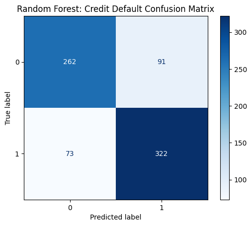
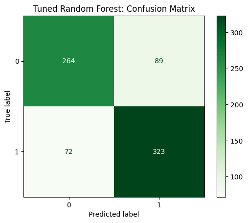
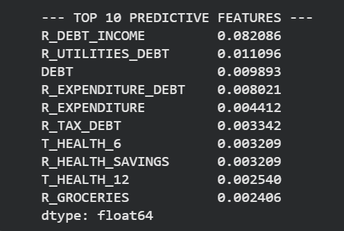

# 💳 Credit Scoring Model
### CodeAlpha Internship — Task 1

> A machine learning pipeline that predicts an individual's creditworthiness using past financial data, built with Random Forest and scikit-learn.

---

## 📌 Project Overview

Credit scoring is the backbone of modern lending decisions. This project builds a full end-to-end classification pipeline that:

- Ingests raw synthetic financial data (4,995 customers, 87 columns)
- Engineers a binary target (`Is_Bad_Credit`) from continuous credit scores
- Preprocesses 84 mixed numeric/categorical features through a robust sklearn pipeline
- Trains and tunes a **Random Forest Classifier**
- Evaluates performance using **Precision, Recall, F1-Score, and Confusion Matrix**
- Interprets the model using **Permutation Importance**

---

## 📊 Dataset

**Source:** [Kaggle — Credit Scoring Dataset by SyncoraAI](https://www.kaggle.com/datasets/syncoraai/credit-scoring-dataset)

| Property | Value |
|---|---|
| Total Rows | 4,995 |
| Total Columns | 87 |
| Duplicate Rows | 0 |
| Missing Values | 0 |
| Numeric Features | 85 (51 float64, 34 int64) |
| Categorical Features | 2 object columns |

### Key Columns

| Column | Type | Role |
|---|---|---|
| `CUST_ID` | ID | Dropped — not a feature |
| `CREDIT_SCORE` | Continuous | Used to derive target, then dropped |
| `DEFAULT` | Binary | Dropped — future data leakage |
| `CAT_GAMBLING` | Categorical | Encoded (No / Low / High) |
| `CAT_DEBT`, `CAT_CREDIT_CARD`, etc. | Categorical | Encoded |
| `R_DEBT_INCOME`, `INCOME`, `SAVINGS`… | Numeric | Core predictive features |
| **`Is_Bad_Credit`** | **Binary** | ✅ **Target** — 1 if `CREDIT_SCORE < 600`, else 0 |

---

## 🗂️ Project Structure

```
CodeAlpha_Task1/
│
├── CodeAlpha_Task1.ipynb             # Main notebook
├── README.md                         # This file
│
├── images/
│   ├── confusion_matrix_baseline.png
│   ├── confusion_matrix_tuned.png
│   └── feature_importance.png
│
└── synthetic_e2dabba50a1a4fbcabd601f7883eef1e.csv
```

---

## 🔄 Pipeline Architecture

```
Raw CSV (4,995 rows × 87 cols)
           │
           ▼
  ┌─────────────────┐
  │   Data Audit    │  4,995 rows | 0 duplicates | 0 missing values
  └────────┬────────┘
           │
           ▼
  ┌──────────────────────┐
  │  Feature Engineering │  Is_Bad_Credit = (CREDIT_SCORE < 600)
  │  + Leakage Removal   │  Drop: CUST_ID, CREDIT_SCORE, DEFAULT
  └────────┬─────────────┘
           │  84 features remain
           ▼
  ┌─────────────────────┐
  │  Stratified Split   │  Train 70% (3,497) | Val 15% | Test 15%
  └────────┬────────────┘
           │
           ▼
  ┌──────────────────────────────────────────────┐
  │              ColumnTransformer               │
  │  ┌────────────────┐   ┌────────────────────┐ │
  │  │    Numeric     │   │    Categorical     │ │
  │  │  82 features   │   │  CAT_GAMBLING +    │ │
  │  │ Imputer(median)│   │  other cat cols    │ │
  │  │ StandardScaler │   │  Imputer + OHE     │ │
  │  └────────────────┘   └────────────────────┘ │
  └────────┬─────────────────────────────────────┘
           │
           ▼
  ┌────────────────────────┐
  │  RandomForestClassifier│  n_estimators=100
  │  class_weight='balanced│  Handles class imbalance
  └────────┬───────────────┘
           │
           ▼
  ┌────────────────────┐     ┌────────────────────────┐
  │   Evaluation       │     │  Permutation Importance│
  │  (Validation Set)  │     │  Top 10 features ranked│
  └────────┬───────────┘     └────────────────────────┘
           │
           ▼
  ┌───────────────────────┐
  │  RandomizedSearchCV   │  10 combos | 3-fold CV | F1 scoring
  │  Hyperparameter Tuning│
  └───────────────────────┘
```

---

## 🖼️ Results & Visualizations

### Confusion Matrix — Baseline Model


| | Predicted: Good (0) | Predicted: Bad (1) |
|---|---|---|
| **Actual: Good (0)** | ✅ 262 (TN) | ❌ 91 (FP) |
| **Actual: Bad (1)** | ❌ 73 (FN) | ✅ 322 (TP) |

---

### Confusion Matrix — Tuned Model


| | Predicted: Good (0) | Predicted: Bad (1) |
|---|---|---|
| **Actual: Good (0)** | ✅ 264 (TN) | ❌ 89 (FP) |
| **Actual: Bad (1)** | ❌ 72 (FN) | ✅ 323 (TP) |

> Tuning improved TN by **+2** and TP by **+1**, reducing both false positives and false negatives.

---

### Top 10 Most Predictive Features (Permutation Importance)


| Rank | Feature | Importance Score | Meaning |
|---|---|---|---|
| 1 | `R_DEBT_INCOME` | 0.0821 | Debt-to-income ratio — **strongest signal** |
| 2 | `R_UTILITIES_DEBT` | 0.0111 | Utilities spending relative to debt |
| 3 | `DEBT` | 0.0099 | Raw total debt amount |
| 4 | `R_EXPENDITURE_DEBT` | 0.0080 | Total expenditure vs debt ratio |
| 5 | `R_EXPENDITURE` | 0.0044 | Overall spending behaviour |
| 6 | `R_TAX_DEBT` | 0.0033 | Tax payments relative to debt |
| 7 | `T_HEALTH_6` | 0.0032 | Health spending (last 6 months) |
| 8 | `R_HEALTH_SAVINGS` | 0.0032 | Health cost relative to savings |
| 9 | `T_HEALTH_12` | 0.0025 | Health spending (last 12 months) |
| 10 | `R_GROCERIES` | 0.0024 | Grocery spending ratio |

**Key Insight:** `R_DEBT_INCOME` is by far the most important feature — ~7× higher than the second feature. Debt-related ratios dominate the top 10, confirming that spending behaviour relative to debt is the primary driver of credit risk.

---

## 📈 Evaluation Metrics

Calculated from the confusion matrices on the **Validation Set (748 samples)**:

| Metric | Baseline Model | Tuned Model |
|---|---|---|
| **Accuracy** | 78.1% | 78.5% |
| **Precision (Bad Credit)** | 78.0% | 78.4% |
| **Recall (Bad Credit)** | 81.5% | 81.8% |
| **F1-Score (Bad Credit)** | ~79.7% | ~80.1% |
| **False Positives** | 91 | 89 |
| **False Negatives** | 73 | 72 |

> ⚠️ **Why F1 over Accuracy?** The dataset has class imbalance. Catching bad credit customers (high Recall) matters most to avoid lending risk, so F1-Score is the primary metric. `class_weight='balanced'` was used to handle this automatically.

---

## ⚙️ Hyperparameter Tuning

`RandomizedSearchCV` searched over:

```python
param_dist = {
    'classifier__n_estimators': [100, 200, 300],
    'classifier__max_depth': [None, 10, 20, 30],
    'classifier__min_samples_leaf': [1, 2, 4, 8],
    'classifier__max_features': ['sqrt', 'log2']
}
# 10 random combinations | 3-fold CV | scored by F1
```

---

## 🚀 How to Run

1. **Set up Kaggle API** credentials, then:
   ```bash
   kaggle datasets download -d syncoraai/credit-scoring-dataset
   unzip credit-scoring-dataset.zip
   ```
2. **Install dependencies:**
   ```bash
   pip install pandas scikit-learn matplotlib numpy
   ```
3. **Run all cells** in `CodeAlpha_Task1.ipynb` top to bottom

---

## 🛠️ Tech Stack

| Tool | Purpose |
|---|---|
| Python 3 | Core language |
| pandas | Data loading & manipulation |
| scikit-learn | Pipeline, preprocessing, modeling, evaluation |
| matplotlib | Confusion matrix & feature importance plots |
| Kaggle API | Dataset download |

---

## 👤 Author

**Anas MOhamed**
CodeAlpha Machine Learning Internship — Task 1
[LinkedIn](https://www.linkedin.com/in/anas-mohamed-716959313/) · [GitHub](https://github.com/Anas-Mohamed-Abdelghany)

---

## 📄 License

This project is for educational purposes as part of the CodeAlpha internship program.
