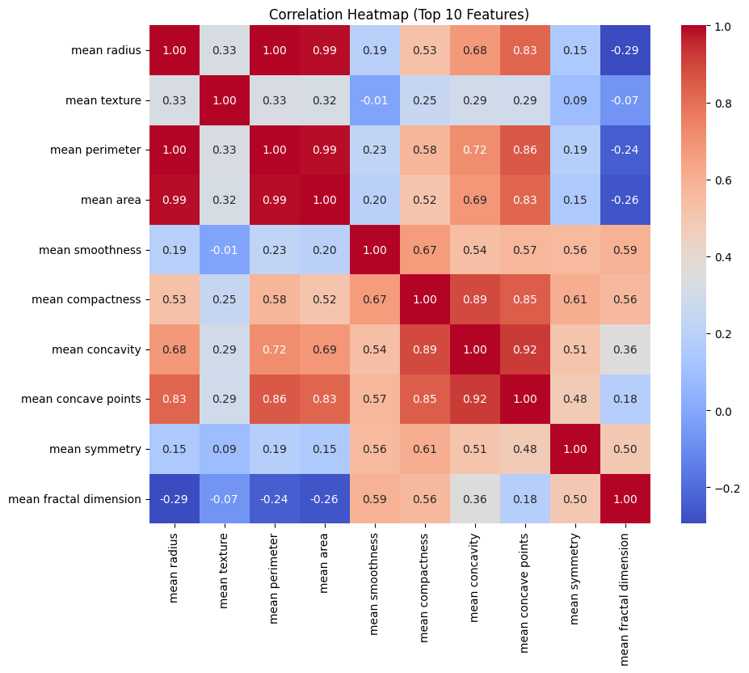
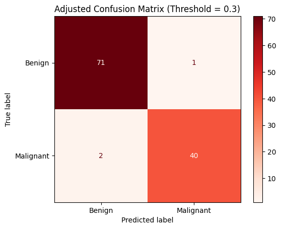

# 🩺 Disease Prediction from Medical Data
### CodeAlpha Internship — Task 3


> A medical-grade binary classification pipeline that predicts breast tumor malignancy with **97% accuracy** and **95% Recall** — built around the principle that a missed cancer is always worse than a false alarm.

---

## 📑 Table of Contents
1. [The Medical Problem](#-the-medical-problem)
2. [Dataset & EDA](#-dataset--eda)
3. [Zero Data Leakage Philosophy](#-zero-data-leakage-philosophy)
4. [Pipeline & Model Selection](#-pipeline--model-selection)
5. [Hyperparameter Tuning](#-hyperparameter-tuning)
6. [Probability Threshold Tuning](#-probability-threshold-tuning)
7. [Final Results](#-final-results)
8. [Deep Error Analysis](#-deep-error-analysis)
9. [Project Structure](#-project-structure)
10. [How to Run](#-how-to-run)

---

## ❤️ The Medical Problem

In healthcare, not all misclassifications are equal. This project was designed around **Asymmetric Error Costs**:

| Error Type | What Happens | Consequence |
|---|---|---|
| **False Positive** | Healthy patient flagged as malignant | Unnecessary biopsy — stressful, costly, but correctable |
| **False Negative** | Malignant tumor missed | Patient goes untreated — **potentially fatal** |

**Design decision:** Every choice in this pipeline — metric, model, threshold — was made to minimise **False Negatives** (maximise Recall/Sensitivity) while keeping Precision at a clinically acceptable level.

---

## 📊 Dataset & EDA

**Source:** [UCI ML Repository — Breast Cancer Wisconsin (Diagnostic)](https://archive.ics.uci.edu/ml/datasets/Breast+Cancer+Wisconsin+(Diagnostic))

| Property | Value |
|---|---|
| Patients | 569 |
| Features | 30 (numeric continuous — radius, area, smoothness, etc.) |
| Class Balance | 62.7% Benign · 37.3% Malignant |
| Missing Values | 0 |

> **Note:** The sklearn dataset encodes 0 = Malignant, 1 = Benign. This was immediately inverted (`target = 1 − original`) so that `1 = Malignant` follows standard medical convention.

### 🔍 Key EDA Finding: Severe Multicollinearity



The correlation heatmap — computed **exclusively on the training set** — revealed extreme feature collinearity:

- `mean radius` ↔ `mean perimeter` → **r = 1.00**
- `mean radius` ↔ `mean area` → **r = 0.99**
- `mean perimeter` ↔ `mean area` → **r = 0.99**

These three features measure the same physical space. This finding directly ruled out Logistic Regression (which is severely harmed by multicollinearity) and justified **SVM** and **Random Forest** as the candidate models.

---

## 🛡️ Zero Data Leakage Philosophy

Data leakage is the leading cause of models that appear to work well but fail in production. Three rules were strictly enforced:

1. **The Split Rule** — `train_test_split` (80/20 Stratified) was the **very first operation**, before any statistics were computed.
2. **The Pipeline Rule** — `StandardScaler` was wrapped inside `sklearn.Pipeline`. It was fitted **only** on training data during each CV fold, never on the full dataset.
3. **The Test Rule** — The 20% hold-out test set was **locked away** and touched exactly **once**, after all decisions were finalised.

---

## 🔄 Pipeline & Model Selection

```
Raw Data (569 patients, 30 features)
            │
            ▼
  ┌─────────────────────┐
  │  Stratified Split   │  Train: 455 (80%) | Test: 114 (20%) — Locked
  └────────┬────────────┘
           │  EDA on training set only
           ▼
  ┌────────────────────────────────────────────────┐
  │          Pipeline (Scikit-Learn)               │
  │  1. StandardScaler()      — scale-sensitive    │
  │  2. class_weight='balanced' — imbalance fix    │
  │  3. Candidates: LogReg · Random Forest · SVM  │
  └────────┬───────────────────────────────────────┘
           │  5-Fold Stratified CV, scored on Recall
           ▼
  ┌────────────────────────┐
  │  Cross-Validation      │
  │  Logistic Reg:  0.9588 │
  │  Random Forest: 0.9471 │
  │  SVM:           0.9529 │  ← winner, tuned further
  └────────┬───────────────┘
           │
           ▼
  ┌─────────────────────────────────────────────────┐
  │  GridSearchCV on SVM (Train Set Only)           │
  │  Best: C=10, kernel='rbf', gamma='scale'        │
  │  Best CV Recall: 0.9647                         │
  └────────┬────────────────────────────────────────┘
           │
           ▼
  ┌────────────────────────────────────┐
  │  Threshold Tuning (PR Curve)       │
  │  0.50 → 0.30 | FN: 3 → 2 patients │
  └────────┬───────────────────────────┘
           │
           ▼
  ┌───────────────────────────────────────────────┐
  │  Final Evaluation + Serialization             │
  │  Accuracy: 97% | Recall: 95% | F1: 0.96      │
  │  Saved: breast_cancer_svm_pipeline_v1.joblib  │
  └───────────────────────────────────────────────┘
```

### Model Selection Reasoning

| Model | CV Recall | Why Considered | Why Not Chosen |
|---|---|---|---|
| Logistic Regression | 0.9588 | Fast, interpretable | Severely harmed by 0.99 feature correlations |
| Random Forest | 0.9471 | Robust to collinearity | Lowest Recall; ensemble variance on small data |
| **SVM (RBF)** | **0.9529 → 0.9647*** | Robust to collinearity; distance-based | — **Winner** |

*After GridSearchCV tuning.

---

## ⚙️ Hyperparameter Tuning

`GridSearchCV` was used (not Random Search) because the SVM search space is small (24 combinations) — exhaustive search is practical and guarantees the optimal result.

```python
param_grid = {
    'svm__C':      [0.1, 1, 10, 100],
    'svm__kernel': ['linear', 'rbf'],
    'svm__gamma':  ['scale', 0.01, 0.1]
}
# 5-fold Stratified CV | Scored on Recall | Fitted on training set only
```

| Parameter | Best Value | Why |
|---|---|---|
| `C = 10` | Higher regularisation | Allows tighter margin; model works harder to catch malignant cases |
| `kernel = 'rbf'` | RBF | Captures non-linear relationships between correlated features |
| `gamma = 'scale'` | Auto-scaled | Adapts kernel bandwidth to data variance automatically |

---

## 📉 Probability Threshold Tuning

The default classification threshold of 0.50 was lowered to **0.30** by analysing the Precision-Recall curve.

> Any patient with a predicted malignancy probability ≥ 30% is classified as **Malignant**.

| Metric | Threshold = 0.50 | Threshold = 0.30 | Change |
|---|---|---|---|
| **Malignant Recall** | 0.93 | **0.95** | ↑ More cancers caught |
| **False Negatives** | 3 patients | **2 patients** | ↓ 1 fewer missed cancer |
| **False Positives** | 0 patients | **1 patient** | ↑ 1 extra biopsy |
| **Benign Precision** | 0.96 | **0.97** | ↑ Slightly improved |
| **Overall F1** | 0.96 | **0.96** | Stable |

The threshold was not lowered further because below 0.30, Precision degrades sharply — producing too many unnecessary biopsies to be clinically acceptable.

---

## 📈 Final Results

### Confusion Matrix (Threshold = 0.30)



| | Predicted: Benign | Predicted: Malignant |
|---|---|---|
| **Actual: Benign** | ✅ 71 (TN) | ❌ 1 (FP) |
| **Actual: Malignant** | ❌ 2 (FN) | ✅ 40 (TP) |

### Classification Report

| Class | Precision | Recall | F1-Score | Support |
|---|---|---|---|---|
| Benign | 0.97 | 0.99 | 0.98 | 72 |
| Malignant | **0.98** | **0.95** | **0.96** | 42 |
| **Overall Accuracy** | | | **0.97** | 114 |

---

## 🔬 Deep Error Analysis

Despite threshold adjustment, 2 malignant tumors were missed. Inspecting those specific rows revealed a systematic blind spot:

| Feature | Avg Benign | Avg Malignant | Missed Patient 73 | Missed Patient 99 |
|---|---|---|---|---|
| `mean radius` | 12.15 | 17.53 | **13.80** | **14.42** |
| `mean area` | 463.9 | 987.7 | **584.1** | **642.5** |
| Model Probability | — | — | *2.6% — Confident Benign* | *47.1% — Borderline* |

**Root Cause:** Both missed patients had malignant tumors that were physically *much smaller* than the average cancer in the dataset. The SVM, which heavily weights the dominant size features (radius, area, perimeter), classified them as "slightly large benign" tumors. Patient 73 was missed with 97.4% confidence.

**Proposed Fixes:**
1. **Feature Engineering** — Engineer shape/texture ratios (e.g. `concavity/area`) that detect malignancy independent of physical size.
2. **ADASYN** — Apply adaptive synthetic sampling focused on the hard-to-learn boundary region, not uniform oversampling (SMOTE).
3. **Ensemble** — Combine SVM with a model that learns different boundaries (e.g. Gradient Boosting) to cover the SVM's blind spot.

---

## 🗂️ Project Structure

```
CodeAlpha_Task3/
│
├── CodeAlpha_Task3_Disease_Prediction.ipynb      # Main notebook
├── README.md                                     # This file
├── breast_cancer_svm_pipeline_v1.joblib          # Serialised model
│
└── images/
    ├── EDA.png                                   # Correlation heatmap (train set)
    └── confusion_mat.png                         # Adjusted confusion matrix (0.30 threshold)
```

---

## 🚀 How to Run

1. **Clone the repository:**
   ```bash
   git clone https://github.com/Anas-Mohamed-Abdelghany/CodeAlpha_Task3.git
   cd CodeAlpha_Task3
   ```

2. **Install dependencies:**
   ```bash
   pip install scikit-learn pandas numpy matplotlib seaborn joblib
   ```

3. **Run the notebook:**
   Open `CodeAlpha_Task3_Disease_Prediction.ipynb` in Jupyter or Google Colab and run all cells sequentially.

   > The dataset is loaded automatically via `sklearn.datasets.load_breast_cancer()` — no download required.

4. **Use the saved model:**
   ```python
   import joblib
   import pandas as pd

   model = joblib.load('breast_cancer_svm_pipeline_v1.joblib')

   # patient_data: DataFrame with the 30 feature columns
   prob = model.predict_proba(patient_data)[0][1]
   prediction = "Malignant" if prob >= 0.30 else "Benign"
   ```

---

## 👤 Author

**Anas Mohamed**
CodeAlpha Machine Learning Internship — Task 3
[LinkedIn](https://www.linkedin.com/in/anas-mohamed-716959313/) · [GitHub](https://github.com/Anas-Mohamed-Abdelghany)

---

## 📄 License

This project is for educational purposes as part of the CodeAlpha internship program.