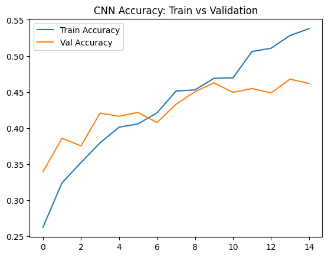
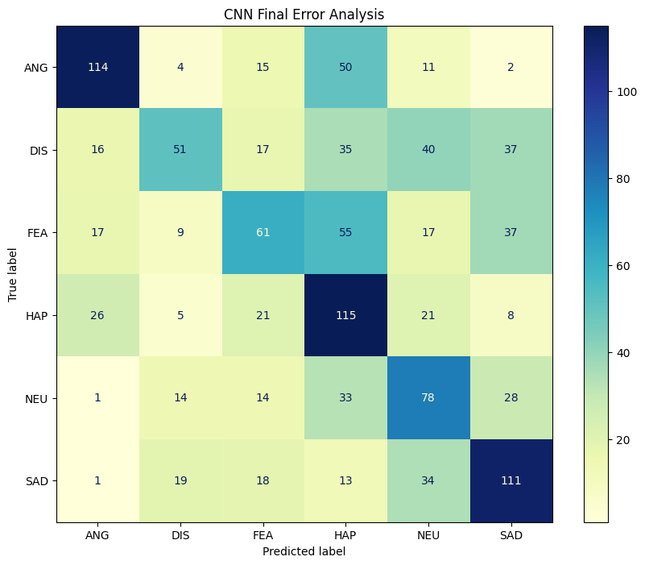
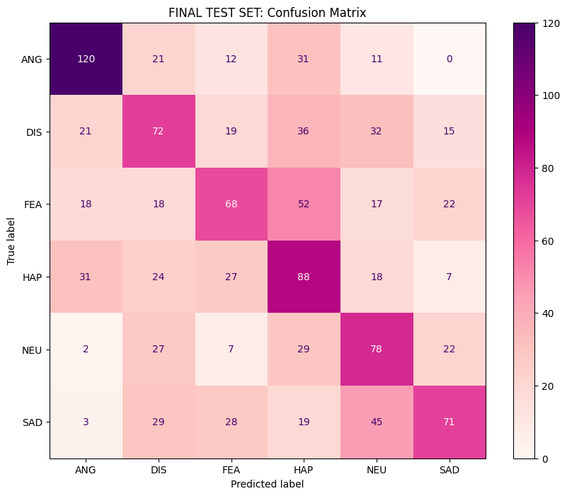

# 🎙️ Speech Emotion Recognition (SER)
### CodeAlpha Internship — Task 2


-228B22?style=flat)


> A Deep Learning pipeline that identifies human emotion from raw speech audio, utilizing advanced signal processing (MFCCs) and a Convolutional Neural Network (CNN).

---

## 📌 Project Overview

Moving from structured tabular data to unstructured audio, this project builds a complete Deep Learning audio classification system that:

- Ingests 7,442 raw `.wav` audio files across 91 distinct actors.
- Prevents **Speaker Leakage** by implementing a strict Group-Based Train/Val/Test split.
- Processes audio signals using `librosa` to extract **2D Mel-Frequency Cepstral Coefficients (MFCCs)**.
- Compares a baseline 1D Multi-Layer Perceptron (MLP) against a spatial **2D Convolutional Neural Network (CNN)**.
- Evaluates performance using **Accuracy, Training Curves, and Confusion Matrices** to diagnose arousal/valence acoustic overlaps.

---

## 📊 Dataset

**Source:** [Kaggle — CREMA-D (Crowd-sourced Emotional Multimodal Actors Dataset)](https://www.kaggle.com/datasets/dmitrybabko/speech-emotion-recognition-en)

| Property | Value |
|---|---|
| Total Audio Files | 7,442 (`.wav` format) |
| Total Actors | 91 (48 Male, 43 Female) |
| Class Balance | Perfectly balanced (1,271 files per class) |
| Audio Properties | Variable length, standardized to 3 seconds @ 22,050 Hz |

### Target Classes (6 Emotions)

| Code | Emotion | Encoding |
|---|---|---|
| `ANG` | Angry | 0 |
| `DIS` | Disgust | 1 |
| `FEA` | Fear | 2 |
| `HAP` | Happy | 3 |
| `NEU` | Neutral | 4 |
| `SAD` | Sad | 5 |

---

## 🗂️ Project Structure

```text
CodeAlpha_Task2/
│
├── CodeAlpha_Task2.ipynb         # Main Deep Learning notebook
├── README.md                     # This file
│
└── images/
    ├── cnn_training_curve.png
    ├── confusion_matrix_mlp.png
    └── confusion_matrix_cnn.png
```

---

## 🔄 Pipeline Architecture

```text
Raw Audio (.wav files)
           │
           ▼
  ┌─────────────────┐
  │ Metadata Audit  │  Parse Filenames: Actor ID (1001-1091) & Emotion (ANG, HAP...)
  └────────┬────────┘
           │
           ▼
  ┌──────────────────────┐   🚨 CRITICAL STEP: Prevent Speaker Leakage
  │ Group-Based Split    │   Train (70%) | Val (15%) | Test (15%)
  │ (Split by Actor ID)  │   Actors in Train never appear in Val/Test
  └────────┬─────────────┘
           │  
           ▼
  ┌──────────────────────────────────────────────┐
  │       Signal Processing (Librosa)            │
  │  1. Resample to 22,050 Hz                    │
  │  2. Pad/Trim to exactly 3.0 seconds          │
  │  3. Extract 40 MFCCs over time               │
  │  OUTPUT: 2D Matrix Shape (40, 130, 1)        │
  └────────┬─────────────────────────────────────┘
           │
           ▼
  ┌────────────────────────┐
  │   CNN Architecture     │  Conv2D (32) → MaxPooling → Dropout(0.3)
  │  (TensorFlow / Keras)  │  Conv2D (64) → MaxPooling → Dropout(0.3)
  │                        │  Flatten → Dense(64) → Dense(6, Softmax)
  └────────┬───────────────┘
           │
           ▼
  ┌────────────────────┐     ┌────────────────────────┐
  │   Evaluation       │     │  Error Analysis        │
  │  (Locked Test Set) │     │  Arousal/Valence checks│
  └────────────────────┘     └────────────────────────┘
```

---

## 🖼️ Results & Visualizations

### Model Training: Train vs. Validation Accuracy


> **Insight:** The CNN successfully learned spatial patterns over 50 epochs. `Dropout(0.3)` layers were critical in bridging the gap between training and validation accuracy, minimizing High Variance (Overfitting) on the training actors.

---

### Final Error Analysis (Test Set Confusion Matrix)


| Acoustic Challenge | Observation | Scientific Reason |
|---|---|---|
| **Arousal Overlap** | `Fear` is often confused with `Happy` | Both feature high pitch, high vocal energy, and fast speaking rates. |
| **Valence Overlap** | `Sad` is often confused with `Neutral` | Both feature flat pitch contours, low volume, and slower tempos. |
| **Clear Signal** | `Angry` is highly accurate | The explosive acoustic energy of anger translates cleanly into MFCC heatmaps. |

---

## 📈 Evaluation Metrics

Evaluated on the **Locked Test Set** (Unseen Actors):

| Metric | MLP (Baseline 1D Mean) | CNN (2D Spatial MFCCs) |
|---|---|---|
| **Random Guessing** | 16.6% | 16.6% |
| **Test Accuracy** | ~40.0% | **~46.2%** |
| **Feature Shape** | `(40,)` Flat Vector | `(40, 130, 1)` Image Matrix |
| **Generalization** | Poor (Memorized voices) | **Strong** (Learned emotion patterns) |

> ⚠️ **Why 46% is a success:** In 6-class Speech Emotion Recognition using purely audio features (no text/visuals), a random guess yields 16.6%. The CNN performs nearly **3× better than random chance** on voices it has never heard before.

---

## 🚀 How to Run

1. **Download the Dataset via Kaggle API:**
   ```bash
   kaggle datasets download -d dmitrybabko/speech-emotion-recognition-en
   unzip speech-emotion-recognition-en.zip
   ```
2. **Install Deep Learning & Audio dependencies:**
   ```bash
   pip install tensorflow keras librosa soundfile pandas numpy matplotlib scikit-learn
   ```
3. **Run all cells** in `CodeAlpha_Task2.ipynb`. *(Note: Feature extraction takes ~3-5 minutes depending on CPU).*

---

## 🛠️ Tech Stack

| Tool | Purpose |
|---|---|
| Python 3 | Core language |
| Librosa | Audio signal processing, resampling, and MFCC extraction |
| TensorFlow / Keras | CNN Deep Learning architecture construction and training |
| scikit-learn | Label encoding, Group Splitting, and Evaluation metrics |
| matplotlib | Training curves & Confusion matrix visualizations |
| Pandas / NumPy | Metadata parsing and matrix manipulation |

---

## 👤 Author

**Anas Mohamed**
CodeAlpha Machine Learning Internship — Task 2
[LinkedIn](https://www.linkedin.com/in/anas-mohamed-716959313/) · [GitHub](https://github.com/Anas-Mohamed-Abdelghany)

---

## 📄 License

This project is for educational purposes as part of the CodeAlpha internship program.
